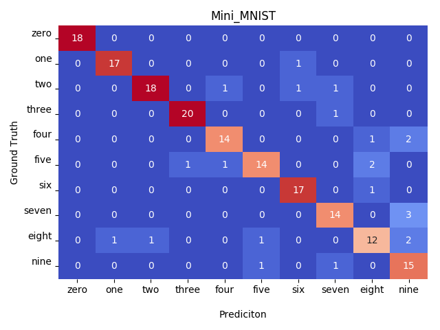

.. _mini-mnist-tutorial:

####################
Mini MNIST Tutorial
####################

This tutorial aims to provide a reference code using the tf_image_classification framework.
The dataset used is a subset of the MNIST and it is versioned both images tf-records.
This tutorial comprises:

    * Dataset preprocessing using `DataFlow <https://cloud.google.com/dataflow/>`_, the GCP `Apache Beam <https://beam.apache.org/>`_ runner
    * Creation of your own estimator
    * Training 
    * Model post-processing for deployment.

For this tutorial, it was used the networks provided by `TensorFlow Slim <https://github.com/tensorflow/models/tree/master/research/slim/nets>`_ and also a network trained from scratch. Please, take a look on the source code.

.. note::

    The GCS paths presented here are just examples. 
    Alter them according to your needs and your project_id on GCP.

***********************************************************
Transform images and labels into tf-records using Dataflow
***********************************************************

The dataset used in this tutorial consists of only 600 images, so you can easily perform this operation locally.
Once dealing with a huge amount of data, it is preferable to preprocess your dataset on cloud. 
Using DataFlow you can achieve this seamlessly by just adding the flags ``--cloud`` and ``--num_workers``.
If you prefer you can let DataFlow to autoscale but just not including ``--num_workers``

HOW TO RUN
===========

Train set
----------

Cloud
^^^^^^

.. code-block:: bash
    
    python dataflow_jpeg_to_tfrecord.py \
        --input_path gs://mini_mnist/trainset_gcs.csv \
        --input_labels gs://mini_mnist/metadata/labels.txt \
        --output_path gs://mini_mnist/tf_records/train \
        --num_workers 10 \
        --job_name mini-mnist-train \
        --cloud

Local
^^^^^^

.. code-block:: bash

    python dataflow_jpeg_to_tfrecord.py \
        --input_path ./dataset/trainset_local.csv \
        --input_labels ./labels.txt \
        --output_path ./dataset/tf_records/train

Eval set
---------

Cloud
^^^^^^

.. code-block:: bash

    python dataflow_jpeg_to_tfrecord.py \
        --input_path gs://mini_mnist/evalset_gcs.csv \
        --input_labels gs://mini_mnist/metadata/labels.txt \
        --output_path gs://mini_mnist/tf_records/eval \
        --num_workers 10 \
        --job_name mini-mnist-eval \
        --cloud

Local
^^^^^^

.. code-block:: bash

    python dataflow_jpeg_to_tfrecord.py \
        --input_path ./dataset/evalset_local.csv \
        --input_labels ./labels.txt \
        --output_path ./dataset/tf_records/eval

Input files
------------
    
**label.txt** contains the labels itself as strings. It is used gerenerate numerical indices.
    
>>> zero
... one
... two
... .
... .
... nine

**trainset_gcs.csv** and **eval_gcs.csv** are the list of image paths and their labels

>>> gs://mini_mnist/images/1/img_249.jpg,one
... gs://mini_mnist/images/1/img_12.jpg,one
... gs://mini_mnist/images/1/img_140.jpg,one
... gs://mini_mnist/images/1/img_401.jpg,one
... .
... .

*******************
Training Estimator
*******************

Take a look on **MiniMNIST** class on **train_mini_mnist.py**. 
There it's implemented the following methods from :class:`~tf_image_classification.estimator_specs.EstimatorSpec`

    * :func:`~tf_image_classification.estimator_specs.EstimatorSpec.get_preproc_fn`
    * :func:`~tf_image_classification.estimator_specs.EstimatorSpec.get_model_fn`
    * :func:`~tf_image_classification.estimator_specs.EstimatorSpec.metric_ops`
    * :func:`~tf_image_classification.estimator_specs.EstimatorSpec.input_fn`: This isn't implemented by `MiniMNIST` once it's already implemented in the base class.

.. note::
 
    * IT IS VERY IMPORTANT TO RETRIEVE THE REGULARIZATION LOSSES AND ADD THEM TO YOUR LOSS, OTHERWISE YOUR MODEL WILL BE PRONE TO **OVERFITTING**.
    * **DO** RETRIEVE OPS UNDER **UPDATE_OPS** COLLECTION AND ADD THEM TO BE EXECUTED, OTHERWISE YOUR BATCH_NORM VARIABLES **WON'T**  BE UPDATED
    * Sorry for the **UPPERCASE**, we suffered a lot with that in the beginning.

HOW TO RUN
===========

Local
-----

.. code-block:: bash

    python train_mini_mnist.py \
        --batch_size 1 --train_steps 100 \
        --train_metadata ./dataset/tf_records/train* \
        --eval_metadata ./dataset/tf_records/eval* \
        --warm_start_ckpt ./checkpoints/inception_v4.ckpt \
        --model_dir ./trained_models --eval_freq 6 \
        --eval_throttle_secs 15 -\
        -learning_rate 0.001 \
        --image_size 299 \
        --labels ./labels.txt

.. note::

    Inception_V4 was trained with 299x299 images, so as the original images are 28x28, it is necessary to specify the flag `--image_size`

Cloud
------

Before running the training on ML Engine, you must package your project first.
You can do this by running the following command:

.. code-block:: bash
    
    python setup.py sdist

You'll se that a directory **dist** is created and it contains your project package as a **tar.gz** file.
As the code depends both of the _tf_image_classification framework and slim, their packages needed to be generated.
In our case, they are already on GCS, so we won't need to package them, but just make a reference when submiting the job.
However, you can also make references for these packages locally.

    * `tf_image_classifier` : **gs://libs/tf_image_classification-3.0.0.tar.gz**
    * `slim` : **gs://libs/slim-0.1.tar.gz**

.. code-block:: bash

    JOB_ID="MINI_MNIST_${USER}_$(date +%Y%m%d_%H%M%S)"

    gcloud ml-engine jobs submit training ${JOB_ID} \
    --job-dir=gs://mini_mnist/${JOB_ID} --module-name mini_mnist.train_mini_mnist \
    --packages dist/mini_mnist-0.1.tar.gz,gs://libs/tf_image_classification-3.0.0.tar.gz,gs://libs/slim-0.1.tar.gz \
    --region us-east1 --config ./cloud.yml --  \
    --batch_size 32 --train_steps 1000 \
    --train_metadata gs://mini_mnist/tf_records/train* \
    --eval_metadata gs://mini_mnist/tf_records/eval* \
    --warm_start_ckpt gs://mini_mnist/pretrained_ckpt/inception_v4.ckpt \
    --model_dir gs://mini_mnist/trained_models/${JOB_ID} \
    --eval_freq 6 --eval_throttle_secs 15 \
    --learning_rate 0.00001 \
    --image_size 299 \
    --labels gs://mini_mnist/labels.txt

**********************
Improve your results
**********************

When it is used a pretrained model it was observed that with two-step training better results could be achieved. 
On the first step, transfer learning is done and for that only the last layers are trained. This allows softer weight changes when training all variables.
On the second step, all variables are set to be trained.

Transfer Learning
==================

.. code-block:: bash

    JOB_ID_TRANSFER="MINI_MNIST_TRANSFER_${USER}_$(date +%Y%m%d_%H%M%S)"

    gcloud ml-engine jobs submit training ${JOB_ID_TRANSFER} \
        --job-dir=gs://mini_mnist/experiments/${JOB_ID_TRANSFER} \
        --module-name mini_mnist.train_mini_mnist \
        --packages mini_mnist-0.1.tar.gz,gs://bucket_name/tf_image_classification-3.0.0.tar.gz,gs://bucket_name/slim-0.1.tar.gz \
        --region us-east1 --config ./cloud.yml --  \
        --batch_size 32 --train_steps 10000 \
        --train_metadata gs://mini_mnist/tf_records/train* \
        --eval_metadata gs://mini_mnist/tf_records/eval* \
        --warm_start_ckpt gs://mini_mnist/pretrained_ckpt/inception_v4.ckpt \
        --model_dir gs://mini_mnist/trained-checkpoints/${JOB_ID_TRANSFER} \
        --eval_freq 6 --eval_throttle_secs 15 --learning_rate 0.000001 \
        --learning_rate_decay_type fixed --image_size 299  --weight_decay 0.0004 \
        --trainable_scopes MiniMNIST \
        --checkpoint_restore_scopes Inception_V4 \
        --checkpoint_exclude_scopes InceptionV4/AuxLogits,InceptionV4/Logits

Fine Tuning
=============

.. code-block:: bash

    JOB_ID_FINE="MINI_MNIST_FINE_TUNE_${USER}_$(date +%Y%m%d_%H%M%S)"

    gcloud ml-engine jobs submit training ${JOB_ID_FINE} \
        --job-dir=gs://mini_mnist/experiments/${JOB_ID_FINE} \
        --module-name --module-name mini_mnist.train_mini_mnist \
        --packages dist/mini_mnist-0.1.tar.gz,gs://bucket_name/tf_image_classification-3.0.0.tar.gz,gs://bucket_name/slim-0.1.tar.gz \
        --region us-east1 --config ./cloud.yml -- \
        --batch_size 32 --train_steps 10000 \
        --train_metadata gs://mini_mnist/tf_records/train* \
        --eval_metadata gs://mini_mnist/tf_records/eval* \
        --warm_start_ckpt gs://mini_mnist/trained-checkpoints/${JOB_ID_TRANSFER} \
        --model_dir gs://mini_mnist/trained-checkpoints/${JOB_ID_FINE} \
        --eval_freq 6 --eval_throttle_secs 15 --learning_rate 0.0001 \
        --learning_rate_decay_type fixed  \
        --weight_decay 0.00004 --optimizer adam 

Training from scratch
======================

If you don't want to use a pretrained network you can just ignore the `checkpoint` argument.

.. code-block:: bash

    JOB_ID="MINI_MNIST_TRAIN_${USER}_$(date +%Y%m%d_%H%M%S)"

    gcloud ml-engine jobs submit training ${JOB_ID} \
        --job-dir=gs://mini_mnist/experiments/${JOB_ID} \
        --module-name mini_mnist.train_mini_mnist \
        --packages dist/mini_mnist-0.1.tar.gz,gs://bucket_name/tf_image_classification-3.0.0.tar.gz,gs://bucket_name/slim-0.1.tar.gz \
        --region us-east1 --config ./cloud.yml --  \
        --batch_size 32 --train_steps 10000 \
        --train_metadata gs://mini_mnist/tf_records/train* \
        --eval_metadata gs://mini_mnist/tf_records/eval* \
        --model_dir gs://mini_mnist/trained_models/${JOB_ID} \
        --eval_freq 6 --eval_throttle_secs 15 \
        --image_size 32 --optimizer adadelta

On **cloud.yml** it is defined the cluster specifications

.. code-block:: yaml

    trainingInput:
        runtimeVersion: "1.8"   
        scaleTier: CUSTOM
        masterType: standard_gpu
        workerCount: 5
        workerType: standard_gpu
        parameterServerCount: 3
        parameterServerType: standard

Evaluation
===========

You may want to perform a full evaluation on your eval set or any other dataset. Use the flag ``--evaluate`` and let the framework do the work for you.
It will generate a confusion matrix as a **png** image.

   Mini MNIST Confusion Matrix

Beautiful, isn't it?

.. code-block:: bash

    JOB_ID_EVAL="MINI_MNIST_EVAL_${USER}_$(date +%Y%m%d_%H%M%S)"

    gcloud ml-engine jobs submit training ${JOB_ID_EVAL} \
        --job-dir=gs://mini_mnist/experiments/${JOB_ID_EVAL} \
        --module-name mini_mnist.train_mini_mnist \
        --packages dist/mini_mnist-0.1.tar.gz,gs://bucket_name/tf_image_classification-3.0.0.tar.gz,gs://bucket_name/slim-0.1.tar.gz \
        --region us-east1 --config ./cloud_eval.yml --  \
        --batch_size 32 --eval_metadata gs://mini_mnist/tf_records/eval* \
        --image_size 32 --evaluate \
        --model_dir gs://mini_mnist/trained_models/MINI_MNIST_TRAIN_ID \        
        --output_cm_folder gs://mini_mnist/experiments/MINI_MNIST_TRAIN_ID/confusion_matrices \
        --labels gs://mini_mnist/metadata/labels.txt

*******************************************
Deploy model on ML Engine
*******************************************

Serve saved model on ML Engine
===============================

Read this simple `tutorial <https://cloud.google.com/ml-engine/docs/tensorflow/deploying-models#creating_a_model_version>`_ .

.. note:: 

    Choose the most recent runtime version. Up to this time, it is the **1.5**

HOW TO RUN
===========

After your model is deployed just run

.. code-block:: bash
    
    gcloud ml-engine predict --model <model-name> --version <version-name> --json-instances ./dataset/sample_b64.json

*******************************************
Post-process model to embed on application
*******************************************

Rename input and output tensors
================================

Up to this time, the model trained both locally or distributed following the aforementioned steps using TF-1.8.0 cannot be frozen directly, because some weird ops appears on the graph regarding batchnorm layers and an error is raised when you try to use it.
A workaround is currently implemented on **rename_nodes.py**. Please, take a look on it.
What it's basically done is to create the graph from the source code (and not by **.meta** file), load the checkpoint and save it again. Yeah, just that. The good point of this approach is that you can rename your input tensor for easy usage on deployment, so you don't have to spend minutes searching it on the graph itself.

HOW TO RUN
-----------

.. code-block:: bash

    python rename_nodes.py --warm_start_ckpt /path/to/model.ckpt \
        --output_checkpoint_path /path/to/renamed_model.ckpt \
        --image_size 30

Post-processing
================

Below it is presented the code to perfom some operations on Mini MNIST example. 
Run the commands below from utils directory.

Freeze graph
=============

Transform **.ckpt** files to **.pb**

.. code-block:: bash

    python freeze_graph.py --model_dir /path/to/renamed_model/ --output_tensors prediction \
        --output_pb /path/to/frozen_model.pb

Prune useless nodes
====================

Prune nodes only used for training

.. code-block:: bash

    python optimize_for_inference.py \
        --input /path/to/frozen_model.pb \
        --output /path/to/opt_frozen_model.pb \
        --input_names input_image \
        --output_names prediction

Quantization
==============

.. code-block:: bash

    python quantize_graph.py  \
        --input /path/to/opt_frozen_model.pb \
        --output /path/to/quantized_model.pb \
        --output_node_names prediction  \
        --print_nodes --mode eightbit --logtostderr

